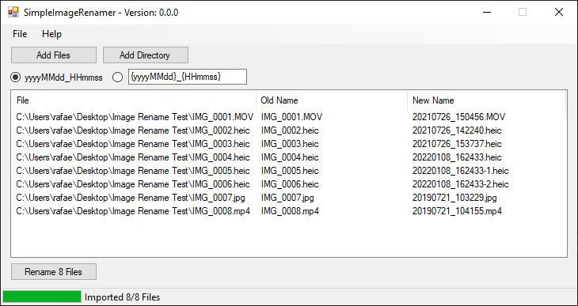

# SimpleImageRenamer
SimpleImageRenamer is a Windows Software to rename photos and videos based on EXIF date data.
For example, if you take a picture on 1/9/2022 at 8:43:46 AM and saved it with the filename IMG_00124.jpeg, SimpleImageRenamer can rename the picture to 20220109_084346.jpeg or other formats.
SimpleImageRenamer can rename multiple images at the same time and currently supports the following file formats:

**Photos:**
* jpg
* jpeg
* heic

**Videos:**
* mp4
* mov

## How to work with UNC paths
To enter UNC paths as location for your photos and videos, just press STRG and click "Add Directory".

## How to use custom formats
To use custom formats, just enter your format in the textbox and hit ENTER. You can use `IMG_{yyyyMMdd}_{HHmmss}` or `{yyyy}-{MM}-{dd}_{HHmmss}` for example.

## Download SimpleImageRenamer
You can either clone the Git project and compile SimpleImageRenamer from source or you can download the latest binary version from here: https://nocksoft.de/?smd_process_download=1&download_id=2619

## ExifTool

SimpleImageRenamer uses ExifTool 12.38 (https://exiftool.org) to extract time information from photos and videos.
ExifTool is released under GNU General Public License and is also available on GitHub (https://github.com/exiftool/exiftool).
